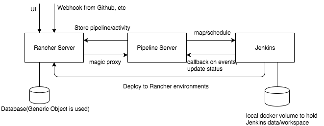

# Design

## Overview

Rancher CICD is a sub system in Rancher environment for running continuous integration and continuous deployment tasks. It should be pluggable and easy to install in existing Rancher systems, via a catalog item. It is natively integrated with Rancher UI for consistent user experience and helps users to do CICD work in Rancher with ease.

## Architecture

The CICD system consists of three parts, Rancher server, Pipeline server and Jenkins, as is shown in following image:

### `Rancher Server`

The CICD system is dependent on Rancher server and leverage its functionalities. Rancher server keeps persistence of CICD job configurations( known as `Pipelines`) and execution records (known as `activities`). These data is stored as generic objects in Rancher server. Rancher server also works as the gateway to receieve user requests and github webhooks and proxy them to Pipeline server.

###`Pipeline Server`

Pipeline server is the API server in CICD system. It provides API to handle Pipeline CRUD operations and other actions such as run, activate, etc. It does not do the actual CICD tasks but distribute them to Jenkins. Pipeline server is in charge of mapping a pipeline definition to Jenkins jobs, scheduling and running Jenkins jobs according to various CICD workflow, such as parallel or conditional tasks.

### `Jenkins`

Jenkins is the executor of CICD tasks. Jenkins jobs are configured and triggered by Pipeline server. Jenkins does what pipeline server ask and it will call back pipeline server on specific events(such as jobs start/end) to update activity status. Jenkins also stores detail logs of the activities and workspace contents in file system, which is mounted in local docker volumes. You can add arbitrary Jenkins slave by setting CICD catalog configuration according to your workload needs. Rancher cli and a dedicated tool running on Jenkins Jobs can directly talk to Rancher Server to do specific tasks, such as getting registry credential for pushing images, and deploying to Rancher environments.

## Pipeline

Pipelines are the construct defining a CI flow. A Pipeline consists of stages and a stage consists of steps. Steps are minimum execution units that do the CI actions. Steps in the same stage can run in sequence or parallel while stages run in sequence. An execution of a pipeline is called an activity. An activity contains its pipeline model and the runtime status of the execution. Pipelines are expected to start with a SCM step.

## Mapping

Each step maps to a Jenkins job so that pipeline server can conveniently control the CI workflow. All steps of  an activity are assigned to the same Jenkins node so that they share the same workspace. Different types of steps map to Jenkins job configurations. A SCM step maps to Jenkins job source code management settings. A task step maps to `docker run` command in bash shell. A build step maps to `docker build` command in bash shell. An upgradeService/Stack/Catalog maps to a combination of commands that talk to Rancher server and do relevant updates.

## Storage

Pipeline/Activity data is majorly stored using Generic Objects in Rancher server, except for the detail logs of the activities, which are stored in Jenkins. We store Jenkins data and workspaces in local docker volumes on hosts running Jenkins master/slave.

## High Availability

High availability is currently not supported. Not easy to do with open source version Jenkins.

## Disaster Recovery

Pipeline server is stateless but when it is down, it fails to receive notifications from Jenkins events. When Pipeline server recovers it will try to sync status of running activities.

When Jenkins master is down, it can be recovered from Jenkins data.